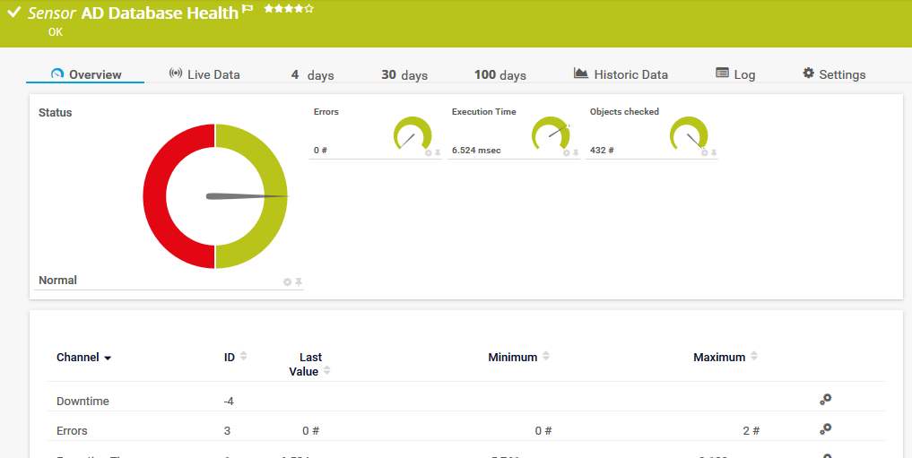
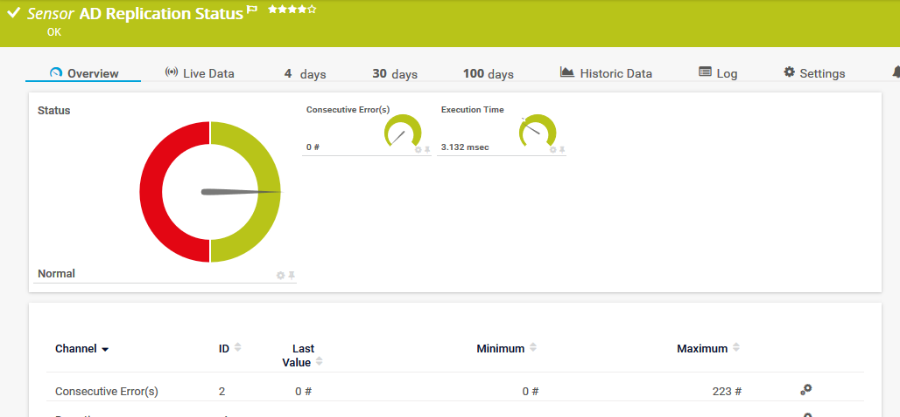

# Samba AD Checks
Simple script sensors for PRTG by Paessler to check the health of a Samba AD

The first script - ad_check_db.sh - is using ***samba-tool dbcheck*** to get just the checked objects and found errors. The variant of this script - ad_check_db_mail.sh - can be used to send a mail with the full output of samba-tool dbcheck when an error is found.

The second script - ad_check_rep - is using ***samba-tool drs showrepl*** to look for errors in replication. This script uses the JSON output to show the last time of replication and its status. It's similar to the original PRTG sensor except it shows the data for each naming context in one senor.

Both sensor have set a standard warning limit of zero so when at least one error is counted the sensor goes into warning state.

Because of AD replication and ***samba-tool drs showrepl*** reports inbound and outbound replication it should be enough to create this sensors on one of your AD DCs.

### Prerequisites

Be sure you have set correct logon values for SSH in your device.

I personally use "Login via private key" with an user especially for monitoring which also may use sudo for this script without a password.


### Installing

Place the script to /var/prtg/scriptsxml on your Synology NAS and make it executable. (You may have to create this directory structure because PRTG expects the script here.)

For ad_check_db.sh:
```
wget https://raw.githubusercontent.com/WAdama/Samba_AD_Checks/master/ad_check_db.sh
chmod +x ad_check_db.sh
```
or ad_check_db_mail.sh:

```
wget https://raw.githubusercontent.com/WAdama/Samba_AD_Checks/master/ad_check_db_mail.sh
chmod +x ad_check_db.sh
```
For ad_check_rep.sh:
```
wget https://raw.githubusercontent.com/WAdama/Samba_AD_Checks/master/ad_check_rep.sh
chmod +x ad_check_db.sh
```
or ad_check_rep.sh_mail:

```
wget https://raw.githubusercontent.com/WAdama/Samba_AD_Checks/master/ad_check_rep_mail.sh
chmod +x ad_check_db.sh
```

On your PRTG system place the file prtg.standardlookups.nas.adstatus.ovl in *INSTALLDIR\PRTG Network Monitor\lookups\custom* and refresh it under **System Administration / Administrative Tools**

In PRTG create under your device which represents your Samba AD DC a SSH custom advanced senor.

Choose under "Script" the script you want to use and enter for the mail versions under "Parameters" the e-mail address which should get the mails.

Example for ad_check_db.sh sensor:




Example for ad_check_rep.sh sensor:


